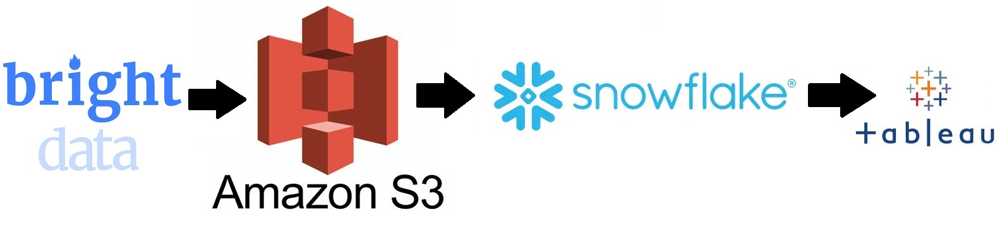
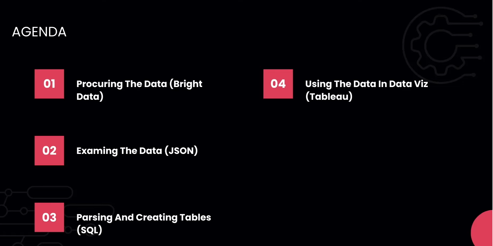

# Web Scraping to Tableau

## Introduction 
In this project, i execute a End-To-End Data Engineering Project Web Scraping to Tableau.

I use different technologies such as SQL, Amazon Web Services (AWS), Snowflake, Tableau.

## Architecture 

## Technology Used
- Amazon Web Service (AWS)
- Snowflake 
- Structured Query Language (SQL)
- Data Visualization Software (Tableau)

## Steps

## Dataset Used
You can use any dataset, we are mainly interested in operation side of Data Engineering.

Here is the dataset used in the project - https://github.com/Math-Muniz/DE-Snowflake-to-tableau/blob/main/raw_g2.json

Here is the link of my query in Snowflake - https://app.snowflake.com/sa-east-1.aws/fx37248/w3Yl8d8FfSHQ#query
